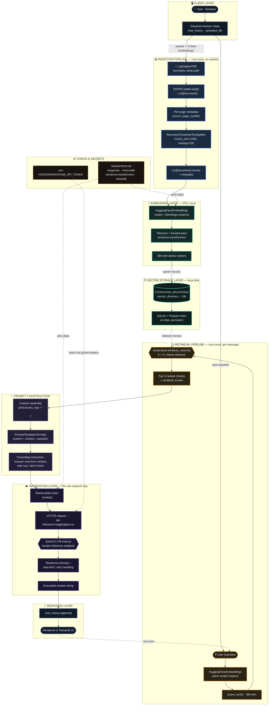

# 📚 RAG over Documents

A local-first **Retrieval-Augmented Generation (RAG)** chatbot that lets you upload a PDF and ask questions about it. Combines local embeddings, a local vector store, and a cloud-hosted LLM for generation.

Built as a hands-on exploration of the RAG pipeline — document ingestion, chunking, embedding, vector search, and grounded LLM generation — end to end.

---

## 🧠 Architecture



Nine layers, two triggers:

| Layer | Fires on | What it owns |
|---|---|---|
| 🖥️ Client | every interaction | Streamlit session state — chat history, uploaded file |
| 📥 Ingestion | PDF upload + "Create Embeddings" | `PyPDFLoader` → `RecursiveCharacterTextSplitter` (1000/250) |
| 🧬 Embedding | ingestion **and** every query | `bge-small-en`, local, CPU-only, same instance both times |
| 🗄️ Storage | written once, read every query | Chroma, persisted to disk as SQLite + Parquet |
| 🔍 Retrieval | every message | cosine similarity search, top-k = 3 |
| 📝 Prompt construction | every message | assembles context + grounding instruction |
| ☁️ Generation | every message | the **only** network call — Qwen2.5-7B-Instruct via HuggingFace Inference API |
| 💬 Response | every message | writes to chat history, renders, loops back for the next turn |
| ⚙️ Config | startup | `.env` token + pinned `requirements.txt`, feeding both the embedding and generation layers |

No Ollama, no locally hosted LLM weights — the embedding model is the only thing that runs on-machine; generation is a single HTTPS round trip. The system is explicitly prompted to answer **only from retrieved context** and say "I don't know" otherwise — reducing hallucination on out-of-scope questions.

---

## 🛠️ Tech Stack

| Component | Tool |
|---|---|
| UI | Streamlit |
| Orchestration | LangChain |
| PDF Parsing | pypdf |
| Embeddings | HuggingFace `BAAI/bge-small-en` (local, CPU) |
| Vector Store | Chroma (local, persistent) |
| LLM | Qwen2.5-7B-Instruct via HuggingFace Inference API |
| Secrets | python-dotenv |

**Design choice:** embeddings run locally (small, fast, free) while generation calls a hosted API (avoids downloading multi-GB model weights, works on CPU-only machines).

---

## 📂 Project Structure

```
rag-buddy/
├── app.py              # Streamlit UI — wires everything together
├── vectors.py           # PDF loading, chunking, embedding → Chroma
├── chatbot.py            # Retrieval + prompt + LLM call
├── requirements.txt
├── .env.example          # Template for required API key
└── .gitignore
```

| File | Responsibility |
|---|---|
| `vectors.py` | `EmbeddingsManager` — loads a PDF, splits it into overlapping chunks, embeds them, and persists them to a local Chroma collection. |
| `chatbot.py` | `ChatbotManager` — reconnects to the same Chroma collection as a retriever, defines the grounded prompt template, and calls the HF-hosted LLM through a `RetrievalQA` chain. |
| `app.py` | Streamlit app — handles file upload, triggers embedding creation, renders chat history, and calls `ChatbotManager.get_response()` per message. |

---

## 🚀 Setup

### 1. Clone and create environment
```bash
git clone https://github.com/navyasoni004/rag-document-buddy.git
cd rag-document-buddy
conda create --name ragbuddy python=3.10
conda activate ragbuddy
pip install -r requirements.txt
```

### 2. Get a HuggingFace API token
Create one at [huggingface.co/settings/tokens](https://huggingface.co/settings/tokens) (read access is enough).

### 3. Configure environment variables
```bash
cp .env.example .env
```
Then edit `.env` and add your token:
```
HUGGINGFACEHUB_API_TOKEN=hf_your_actual_token_here
```

### 4. Run
```bash
streamlit run app.py
```
Open `http://localhost:8501` → **Chatbot** page → upload a PDF → check "Create Embeddings" → ask questions.

---

## ⚠️ Notes & Limitations

- Works best on text-based PDFs; scanned/image-only PDFs need OCR (not included — see `pytesseract` for an extension).
- Free-tier HuggingFace Inference API has rate limits and can be slow during peak load.
- `k=3` retrieval is a tunable trade-off — more chunks give the LLM more context but increase prompt size and latency.

---

## 🔮 Possible Extensions

- Add a reranker (e.g. cross-encoder) after retrieval for better relevance
- Support multi-document / multi-PDF sessions
- Swap Chroma for a hosted vector DB for multi-user deployment
- Add source citations (which chunk/page an answer came from)
